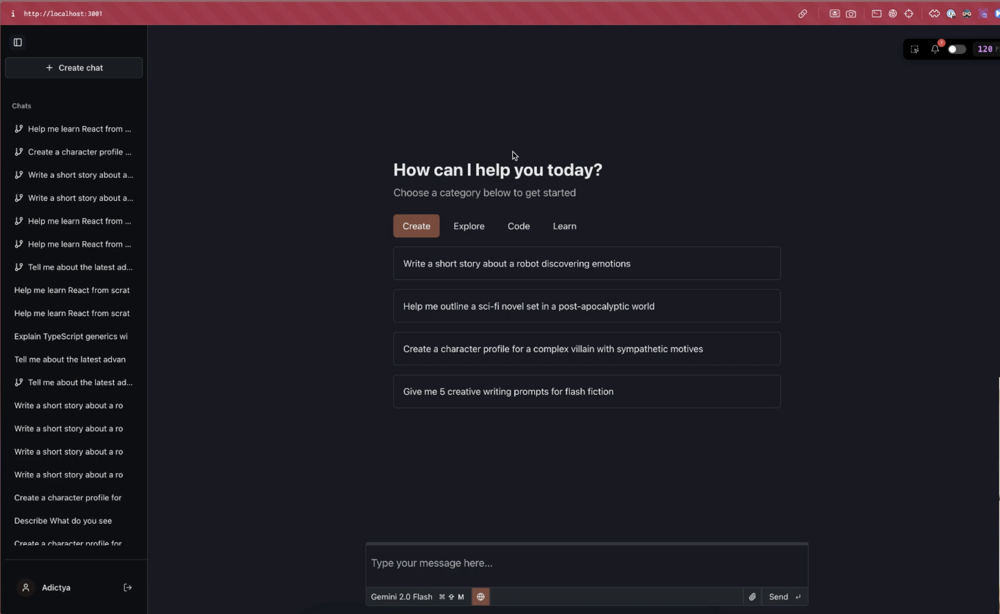

# L1 Chat 💬

> A modern, multi-provider AI chat application with real-time synchronization, beautiful UI, and powerful features.



[](https://bun.sh/)
[](https://reactjs.org/)
[](https://www.typescriptlang.org/)
[](https://tailwindcss.com/)
[](https://hono.dev/)

## ✨ Features

### 🤖 Multi-Provider AI Support
- **OpenAI**: GPT-4o Mini, GPT-4.1, GPT-4.1 Nano
- **Anthropic**: Claude 3.5 Sonnet
- **Google**: Gemini 2.0 Flash, Gemini 2.5 Flash, Gemini 2.5 Pro
- **OpenRouter**: Access to multiple models through a single API

### 🔄 Real-time Synchronization
- **WebSocket-based sync** for instant message updates
- **Multi-device support** - chat from anywhere
- **Offline capability** with local storage
- **Conflict resolution** for concurrent edits

### 💬 Advanced Chat Features
- **Real-time streaming** with smooth text generation
- **Conversation branching** - create new conversation threads from any message
- **Message editing** - modify your messages after sending
- **File attachments** - support for images and PDFs
- **Code highlighting** with syntax highlighting
- **Markdown rendering** with GitHub Flavored Markdown

### 🎨 Modern UI/UX
- **Beautiful, responsive design** built with Tailwind CSS and Shadcn UI
- **Real-time typing indicators**
- **Smooth animations** and transitions
- **Mobile-friendly** interface
- **Keyboard shortcuts** for power users

### 🛠️ Developer Experience
- **TypeScript-first** development
- **Monorepo structure** with Bun workspaces
- **Hot reload** development server
- **Comprehensive linting** with Biome
- **Cloudflare Workers** deployment ready

## 🚀 Quick Start

### Prerequisites
- [Bun](https://bun.sh/) (latest version)
- Node.js 18+ (for some dependencies)

### Installation

1. **Clone the repository**
   ```bash
   git clone https://github.com/yourusername/l1-chat.git
   cd l1-chat
   ```

2. **Install dependencies**
   ```bash
   bun install
   ```

3. **Set up environment variables**
   ```bash
   cp .dev.vars.example .dev.vars
   ```
   
   Add your API keys to `.dev.vars`:
   ```env
   OPENAI_API_KEY=your_openai_key
   ANTHROPIC_API_KEY=your_anthropic_key
   GOOGLE_API_KEY=your_google_key
   OPENROUTER_API_KEY=your_openrouter_key
   GITHUB_CLIENT_ID=your_github_client_id
   GITHUB_CLIENT_SECRET=your_github_client_secret
   BACKEND_URL=http://localhost:3000
   ```

4. **Start the development servers**
   ```bash
   # Start both web and server
   bun run dev
   
   # Or start individually
   bun run dev:web    # Frontend (http://localhost:5173)
   bun run dev:server # Backend (http://localhost:3000)
   ```

5. **Open your browser**
   Navigate to [http://localhost:5173](http://localhost:5173)

## 🏗️ Project Structure

```
l1-chat/
├── apps/
│   ├── web/                 # React frontend application
│   │   ├── src/
│   │   │   ├── components/  # UI components
│   │   │   ├── hooks/       # Custom React hooks
│   │   │   ├── integrations/# External integrations
│   │   │   └── lib/         # Utility functions
│   │   └── package.json
│   └── server/              # Hono backend server
│       ├── src/
│       │   ├── app/         # Application setup
│       │   ├── auth/        # Authentication
│       │   └── index.ts     # Server entry point
│       └── package.json
├── lib/                     # Shared libraries
│   ├── db/                  # Database schemas and utilities
│   ├── db-sqlite/           # SQLite-specific database code
│   ├── env/                 # Environment configuration
│   └── sync/                # Real-time synchronization
└── package.json
```

## 🎯 Key Technologies

### Frontend
- **React 19** - Latest React with concurrent features
- **TanStack Router** - Type-safe routing
- **TanStack Store** - State management
- **Tailwind CSS** - Utility-first CSS framework
- **Shadcn UI** - Beautiful component library
- **Vite** - Fast build tool and dev server

### Backend
- **Bun** - Fast JavaScript runtime
- **Hono** - Lightweight web framework
- **Drizzle ORM** - Type-safe database queries
- **SQLite** - Embedded database
- **WebSockets** - Real-time communication

### AI Integration
- **AI SDK** - Unified AI provider interface
- **Streaming** - Real-time text generation
- **Multi-modal** - Text and image support

## 🔧 Development

### Available Scripts

```bash
# Root level
bun install          # Install all dependencies
bun run dev          # Start both web and server
# -- or --
bunx wrangler dev    # Start as cloudflare worker

```

### Code Style

- **TypeScript** - Strict type checking
- **Biome** - Fast linter and formatter
- **Tabs** - Consistent indentation
- **Double quotes** - String literals
- **PascalCase** - Components
- **camelCase** - Functions and variables

## 🌐 Deployment

### Cloudflare Workers

1. **Build the project**
   ```bash
    bunx wrangler --deploy
   ```

3. **Configure environment variables** in Cloudflare dashboard

### Vercel/Netlify

1. **Build the frontend**
   ```bash
   cd apps/web && bun run build
   ```

2. **Deploy the `dist` folder** to your preferred platform

## 🤝 Contributing

1. Fork the repository
2. Create a feature branch (`git checkout -b feature/amazing-feature`)
3. Commit your changes (`git commit -m 'Add amazing feature'`)
4. Push to the branch (`git push origin feature/amazing-feature`)
5. Open a Pull Request

## 📝 License

This project is licensed under the MIT License - see the [LICENSE](LICENSE) file for details.

## 🙏 Acknowledgments

- [Bun](https://bun.sh/) for the fast JavaScript runtime
- [Hono](https://hono.dev/) for the lightweight web framework
- [TanStack](https://tanstack.com/) for excellent React libraries
- [Shadcn UI](https://ui.shadcn.com/) for beautiful components
- [AI SDK](https://sdk.vercel.ai/) for unified AI integration

---

<div align="center">
  <p>Made with ❤️ by the L1 Chat team</p>
  <p>
    <a href="https://github.com/yourusername/l1-chat/issues">Report Bug</a>
    ·
    <a href="https://github.com/yourusername/l1-chat/issues">Request Feature</a>
  </p>
</div>
